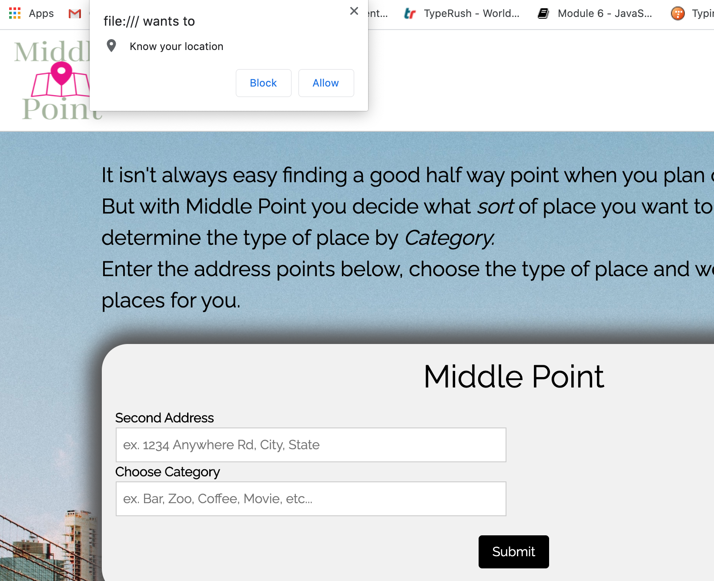
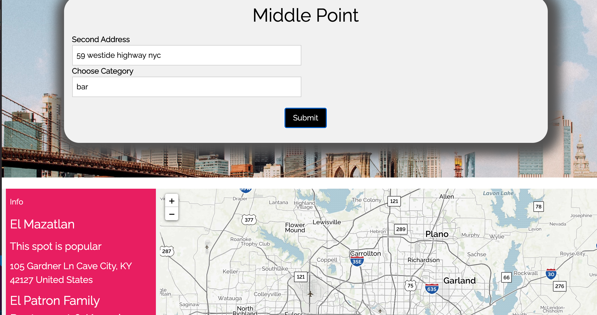

# Middle-Point

# Table of contents:
1. Introduction
2. How it works
3. Results
4. Why
5. Who we are
6. Image
7. Links
# Introduction:
TAPS INC brings you Middle Point. This app is designed to help people find the middle point to meet between two locations.
# How it works: 
The user is presented with a landing page, giving them a snapshot and a brief description of the application. Once the user presses the 'Start here', it leads them to the home page.  
Then they are presented with a pop up box that askes to know the users location. By pressing the 'allow' button, the user's address is stored and used to find the middle point. The user can enter the address they wish to find the middle point for. They can also enter the type of place they want to go, such as; zoo, coffee, bar, etc. A map populates with pinned locations for the user.
# Results:
The app will produce an efficient and effective way to provide the user with a central meeting place, with options for the sort of place they desire to meet in based on what sort of place the user is looking for. 
# Why:
This application offers a convenient and safe way for people to meet up. Whether the user is selling something on Craigslist, or going on a blind date, the app is a great way to find the central meeting point for both parties. 
# Who we are:
But who is TAPS INC? We are Teresa Heidt, Adrian Banda, Preston Nichols and Serge Noumbet. 
# Image:
## Step 1 -
The user goes to the landing page. The main image is of a blue sky, implying that 'Sky's the limit'. Animation starts, where a welcome banner comes down from top center and a blurb about the site moves in from the left. The sky dissapears and the user is presented with a start button

## Step 2 -
When the user goes to the homepage of the application, our logo appears in the top left hand corner. The user is presented with a popup box, which will allow them to share their location. This will enable the site to find the middle point.

## Step 3 -
The user then enters the address they want to find the middle point for, and what sort of place they would like. Then a list of places generates to the side of the screen.

## Step 4
When the user selects the place they want and the address, the list of places populates to the left of the page and pins the exact locations on the map beside the list.

# Links
[Link to the presentation](https://docs.google.com/presentation/d/1Zad3ktdRxT3geROWrj5R1UPwxMr7yqT2CnfBS9Smr-s/edit?usp=sharing)

